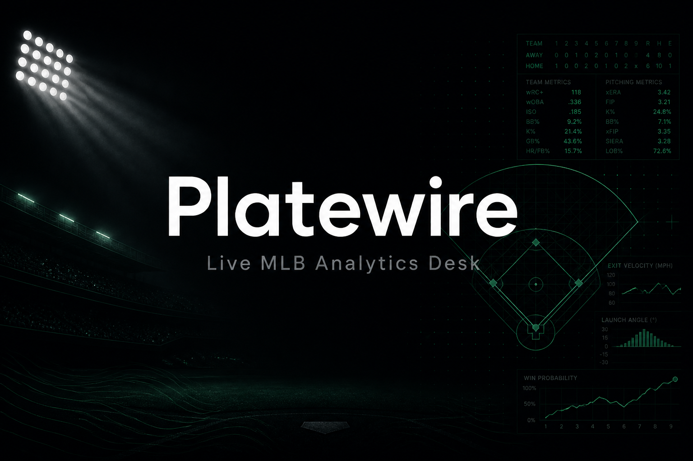

<h1 align="center">Platewire</h1>

<p align="center">
  <strong>Live MLB Analytics Desk</strong> — pipeline матчей, F5-линии, формула, AI-решения и журнал ставок<br/>
  в одном мобильном приложении + Nest API.
</p>

<p align="center">
  
  
  
  
  
</p>

---

## Что внутри

| Область | Что делает |
|--------|------------|
| **Slate / live** | Расписание MLB, live feed, probable SP, погода, Savant / Statcast |
| **Odds** | Скрейп Winline F5 (Playwright), треки линий по стадиям |
| **Formula** | Версии формулы (v42), readiness-гейты, оценка рынков |
| **AI** | Decision agent на матч/трек, curation agent по ledger, чат-агент |
| **Ledger** | Capture / settle F5, аналитика, backtest, Telegram-уведомления |
| **Auth** | Login + Telegram Login Widget + Telegram Mini App (`initData`) |

UI на русском; API и доки — на английском.

---

## Стек

```
platewire/
├── backend/          NestJS 11 + Prisma 7 + Playwright (odds)
├── frontend/         Next.js 16 (App Router) + Tailwind 4 + shadcn
├── docker/nginx/     reverse proxy :8080 → frontend + /api + /docs
├── docker-compose.yml
└── docs/banner.png
```

Данные: MLB Stats API, Baseball Savant, Open-Meteo, Ump Scorecards, Winline.

---

## Быстрый старт (Docker)

Рекомендуемый путь — весь стек одной командой:

```bash
cp .env.docker.example .env.docker
# заполни AI_API_KEY, TELEGRAM_BOT_TOKEN и т.д. при необходимости

docker compose --env-file .env.docker up --build
```

| URL | Назначение |
|-----|------------|
| http://baseballai.mooo.com | Прод (VPS, `HTTP_PORT=80`) |
| http://localhost:8080 | Локально (`HTTP_PORT=8080`) |
| `/docs` | Swagger |
| `/api/v1` | API |

Логин по умолчанию: `admin` / `admin` (из `ADMIN_LOGIN` / `ADMIN_PASSWORD`).

---

## Локальная разработка

### Backend

```bash
cd backend
cp .env.example .env
npm install
npx prisma migrate dev
npm run prisma:seed
npm run start:dev
```

- API: http://localhost:8000/api/v1  
- Docs: http://localhost:8000/docs  

### Frontend

```bash
cd frontend
cp .env.example .env.local
npm install
npm run dev
```

- App: http://localhost:3000  

---

## Приложение

| Раздел | Описание |
|--------|----------|
| **Главная** | Слайт на сегодня: live / upcoming / final, readiness |
| **Матч** | F5 markets, context, формула, AI, составы, погода, ledger |
| **Архив** | Матчи по official date (NY) |
| **Журнал** | Ставки, settle, статистика, AI decision traces |
| **Агент** | Чат + curation proposals (apply / reject) |
| **Настройки** | Формула, pipeline, пользователи (admin) |

---

## Auth

| Метод | Path | Notes |
|-------|------|--------|
| POST | `/auth/login` | `{ login, password, rememberMe? }` → JWT (`12h` / `30d`) |
| POST | `/auth/telegram` | Telegram Login Widget → JWT |
| POST | `/auth/telegram/webapp` | Mini App `initData` → JWT |
| GET | `/auth/me` | Текущий пользователь |
| * | `/users/*` | Admin: CRUD / статусы |

Статусы: `GUEST` → `USER` / `ADMIN`. JWT + status guards глобально; `/health` публичный.

**Telegram**

1. BotFather: токен → `TELEGRAM_BOT_TOKEN`, username → `TELEGRAM_BOT_USERNAME`
2. Login Widget: `/setdomain` → `baseballai.mooo.com`
3. Mini App: Menu Button URL = `http://baseballai.mooo.com` — автологин через `initData`
4. Опционально: бот отвечает AI-агентом (long-poll `getUpdates`), уведомления в `TELEGRAM_NOTIFY_CHAT_IDS`

---

## Pipeline

При `PIPELINE_ENABLED=true` бэкенд крутит стадии по играм:

1. hydrate schedule / live / probable pitchers  
2. context (Savant, umps, weather, …)  
3. odds F5  
4. formula + readiness  
5. AI decision → ledger capture (когда ready)  
6. settle после F5  

Мутации формулы, capture ставок и ручной прогон pipeline — **ADMIN**.

---

## Переменные окружения

Ключевые (полные списки — в `.env.example` / `.env.docker.example`):

| Переменная | Зачем |
|------------|--------|
| `PUBLIC_APP_URL` | Публичный URL (`http://baseballai.mooo.com`) |
| `HTTP_PORT` | Порт nginx на хосте (`80` на VPS, `8080` локально) |
| `DATABASE_URL` | Postgres (в Docker задаётся compose) |
| `JWT_SECRET` | Подпись токенов |
| `TELEGRAM_BOT_TOKEN` | Widget, WebApp, бот, notify |
| `AI_API_KEY` / `AI_BASE_URL` | Decision / curation / chat (OpenAI-compatible) |
| `PIPELINE_ENABLED` | Автопайплайн |
| `WINLINE_*` | URL скрейпа линий |

Секреты (`.env`, `.env.docker`) в git не коммитятся.

Обновление кода на сервере без смены схемы БД (дамп/restore безопасны): `git pull` + `docker compose --env-file .env.docker up -d --build`. Личные тоталы пишутся в существующий JSON snapshot — отдельных Prisma-миграций под них нет.

---

## API

Формула, readiness, ledger, agent, games, odds — в Swagger: `/docs`.  
Префикс API: `/api/v1`.
